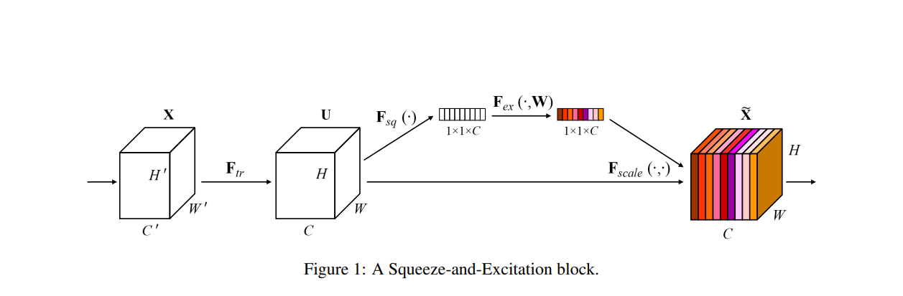
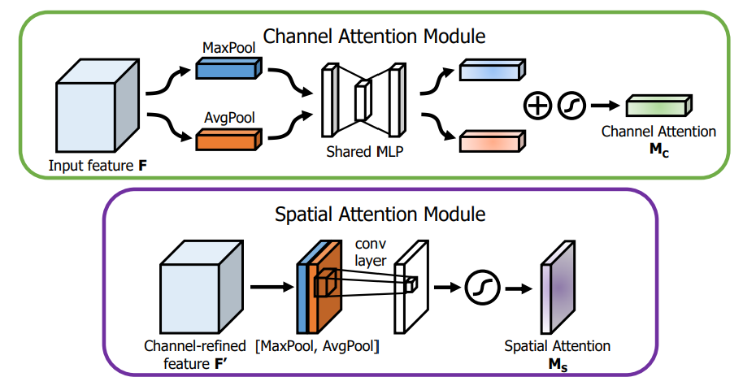
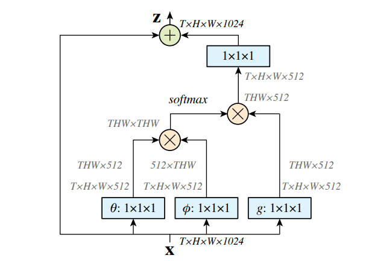
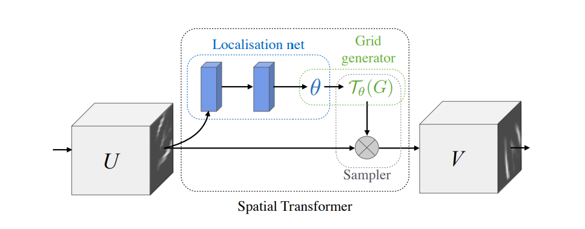
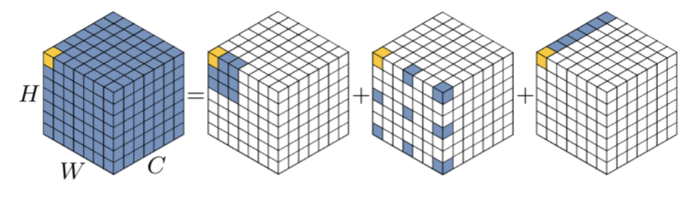
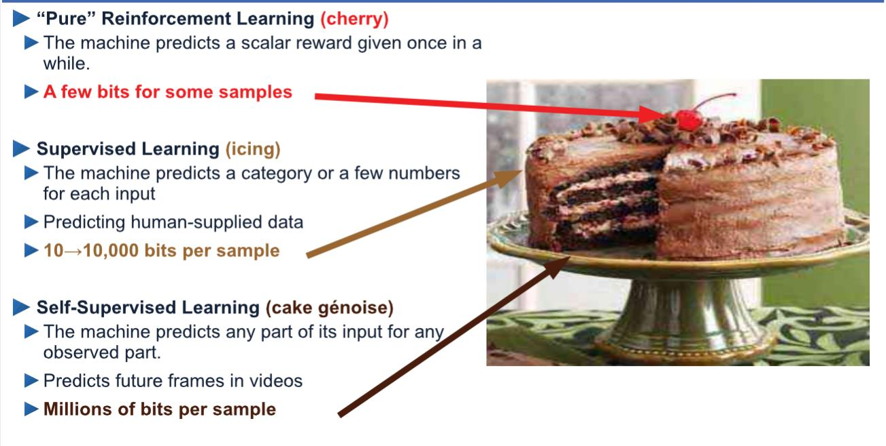

# Classical_Attention_mechanism

## 什么是注意力
> 是一种受人类视觉系统启发得到的模型,人看一个物体的过程,首先关注到一个重点的区域,先去处理这个重点区域。抽象来看,首先第一步需要指出哪些特征是重要的（重要的区域）判断重要不重要需要根据全局的信息来判断,对应CV中得到Attention Map的过程。接着是处理这些重点区域的过程。输出根据输入动态去调整的过程。

- 形式化定义
$$
    Attention = f(g(x),x)
$$
> 其中g(x)是找到重要区域的过程，f(g(x),x)代表使得神经网络专注于这些关键区域

- Self-attention
$$
\begin{align}
    Q,K,V &= Linear(x) \\
    g(x) &= Softmax(QK) \\
    f(g(x),x) &= g(x)V
\end{align}
$$

- SENet
$$
\begin{align}
    g(x) &= Sigmoid(MLP(GAP(x))) \\
f(g(x),x) &= g(x)x
\end{align}
$$

## 注意力机制的分类
|Attention category|Description|
|-|-|
|Channel attention|在通道维度生成attention mask，并用其选择重要的channel
|Spatial attention|在空间维度生成attention mask,并用其选择重要的空间区域
|Temporal attention|在时间维度生成attention mask,并用其选择关键帧
|Branch attention|在不同的分支生成attention mask,并用其选择重要的分支

## Common attention
- SENet(channel attention)

	

> SENet可以自适应的去调整每个通道的重要性，可以理解为一种通道注意力机制。

- CBAM

	

> 通道注意力+空间注意力

$$
\begin{align}
    g(x) &= Sigmoid(Conv(Pooling(x)))\\
    f(g(x),x) &= g(x)x
\end{align}
$$

- Non-Local

	

> 卷积无法处理长距离的依赖关系,是一个静态过程

$$
\begin{align}
    Q,K,V &= Linear(x) \\
    g(x) &= Softmax(QK) \\
    f(g(x),x) &= g(x)V
\end{align}
$$

- Spatial transformer networks(STN)

	

> 对于手写数字识别的图片，经过仿射变换（矩阵的不同参数,旋转,平移...找到哪些区域是重要的,那些区域是不重要的）学习仿射变换的过程可以理解为学习图像的哪些区域是重要的，哪些区域是不想重要的，可以理解为形式化定义中的g(x),就可以得到同类别的其他图像。

$$
\begin{align}
    g(x) &= LocalNet(x) \\
    f(g(x),x) &= Affine Transform(x,g(x))
\end{align}
$$

- deformable convolution

	

> 传统的卷积是周围的规则范围内的点与周围的点进行邻域内的聚合,Deformable Convolution不是传统意义上的卷积，关注的点不一定是淋浴的,可以是散点，但是需要让网络学习出来需要关注的点是哪些点。到最后只需要学习一个offset,每个点向着哪个方向进行偏移，之后再采样这些偏移的点，把这些重要区域利用起来，实现注意力机制。

$$
\begin{align}
   g(x) &= OffsetNet(x) \\
   f(g(x),x) &= Sampling(x,g(x))
\end{align}
$$

传统的卷积是不管输入数据是什么样子都采用相同的模式去计算(采样位置是固定的)，对应位置相乘再相加
$$
\begin{align}
    y_{(p_0)} = \sum_{p_0 \in R}w_{(p_n)} \cdot x_{(p_0 + p_n)}
\end{align}
$$

Deformable Convolution
$$
\begin{align}
   &y_{(p_0)} = \sum_{p_0 \in R}w_{(p_n)} \cdot x_{(p_0 + p_n+ \Delta_{p_{n}})} \\
&offsets = \{\Delta p|n=1,...,N\} 
\end{align}

$$
在原始的卷积中增加偏移，这个偏移量不一定是整数

- 增加偏移量之后像素值如何确定
$$
\begin{align}
    &令p=p_0+p_n+\Delta_{p_n}\\
&x_{(p)}=\sum_q G(q,p)\cdot x(q)\\
&where \quad g(a,b) = max(0,1-|a-b|)
\end{align}
$$

偏移之后的坐标需要由其周围的四个点的像素通过加权求和的方式得到。

- 如何生成偏移offset
每一个点的输入点需要其周围的N个点，具有x,y两个方向，通过卷积层来实现，得到offsets,控制后面的deformable convolution得到最后的output feature map

- Large Kernel Attention (LKA) 3组卷积

 

> DepthWise Conv->Dilated Conv->1x1 conv

|propeties|Convolution|Self-attention|LKA|
|-|-|-|-|
|local Receptive Field| ✔| x | ✔|
|Long Range Dependence| x | ✔| ✔|
|Spatial Adaptability| x| ✔| ✔|
|Channel Adaptability|x|x| ✔|

### Application
- 视觉骨干网络
- BEtT/MAE(Self-supervised)
- 为什么要把Attention和Self-Supervised Learning结合
> 宽泛的来讲,Attention具有Self-Adaptive的性质,这是卷积所不具有的性质。Attention的输出会根据输入进行调整(dynamic process)。因此Attention更适合进行领域迁移,所以适合做Self-Supervised Learning。

### Future Direction

注意力机制方面的研究方向：
- 1.注意力机制的充分必要条件，什么是attention
> 探讨问题的边界，上界(upperBound)和下界(lowerBound)
- 2.更加通用的注意力模块
- 3.注意力机制的可解释性
> 参考卷积中的Saliency Map、CAM
- 4.注意力机制中的稀疏激活
- 5.基于注意力机制的预训练模型

 
> 迁移学习,迁移到没见过的物体上看效果。

- 6.适用于注意力机制的优化方法
  
|模型|优化方法|
|-|-|
CNN | SGD
transformer |AdamW
attention | SAM

- 7.更加好用的attention mechanism
> transformer还不是模型大一统最终的形态,复杂度的问题

- 8.部署注意力机制的模型

### 参考资料
- Xiaolong Wang, Kaiming He,et al. Non-local Neural Networks CVPR 2018
- Jie Hu, Li Shen, et al. Squeeze-and-Excitation Networks CVPR 2018
- Bommasani et al.  On the Opportunities and Risks of Foundation Models
- Meng-Hao, Tian-Xing, et al. Attention mechanisms in computer vision: A survey
- Max Jaderberg, et al. Spatial Transformer Networks NIPS 2015
- Jifeng Dai, et al. Deformable Convolutional Networks ICCV 2017
- Sanghyun Woo, et al. CBAM: Convolutional Block Attention Module ECCV 2018
- Wenhai Wang, et al. Pyramid Vision Transformer: A Versatile Backbone for Dense Prediction without Convolutions ICCV 2021
- Meng-Hao Guo, et al. Visual Attention Network